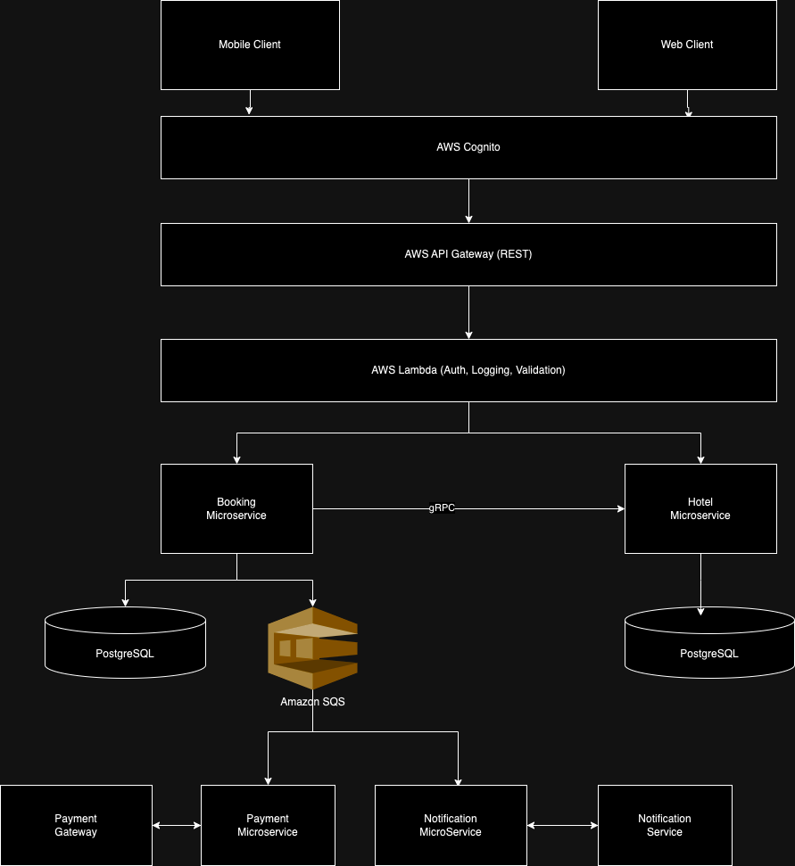

# System Architecture Documentation

## Overview

The system architecture is designed for a hotel booking platform with high scalability, fault tolerance, and real-time capabilities. It incorporates AWS services for identity management, API routing, compute, messaging, and data storage, along with microservices for modular and efficient system design.

## Technology Stack Explanation

### Mobile Client / Web Client:

- **Purpose:** User-facing interfaces for accessing the booking system.
- **Technology:** Cross-platform compatibility via mobile apps and web browsers.
- **Justification:** Ensures accessibility across devices.

### AWS Cognito:

- **Purpose:** Manages user authentication and authorization.
- **Justification:** Provides secure and scalable authentication with features like multi-factor authentication (MFA).

### AWS API Gateway:

- **Purpose:** Acts as an entry point for RESTful APIs, routing client requests to appropriate backend services.
- **Justification:** Handles rate-limiting, caching, and request management with minimal operational overhead.

### AWS Lambda:

- **Purpose:** Processes requests with custom logic for authentication, logging, and validation.
- **Justification:** Serverless architecture reduces operational cost and supports scaling based on demand.

### Booking Microservice:

- **Purpose:** Manages booking logic and interacts with the Hotel Microservice to confirm availability.
- **Justification:** Modular design ensures maintainability and separation of concerns.

### Hotel Microservice:

- **Purpose:** Manages hotel-related operations, such as retrieving available rooms and updating room status.
- **Justification:** Isolated service ensures scalability and independent deployment.

### gRPC (between Booking and Hotel Microservices):

- **Purpose:** Enables fast, low-latency communication between microservices.
- **Justification:** Efficient binary serialization for real-time, synchronous calls.

### Amazon SQS:

- **Purpose:** Handles asynchronous communication for non-urgent tasks like notifications and payment updates.
- **Justification:** Ensures reliable message delivery and decouples services to improve system fault tolerance.

### Payment Microservice:

- **Purpose:** Processes payment transactions through integration with external payment gateways.
- **Justification:** Ensures modularity and flexibility in integrating different payment providers.

### Notification Microservice:

- **Purpose:** Sends user notifications through email or SMS services.
- **Justification:** Decouples notification logic from booking and payment operations.

### PostgreSQL:

- **Purpose:** Manages relational data for both Booking and Hotel Microservices.
- **Justification:** Ensures data consistency and supports complex queries.

## Booking Flow Explanation

### Step 1: Authentication

- A user initiates a booking request via the Mobile/Web Client.
- AWS Cognito validates the user’s identity.

### Step 2: API Routing

- The request is routed through AWS API Gateway to AWS Lambda for pre-processing:
  - Authentication validation.
  - Logging for traceability.
  - Input validation.

### Step 3: Room Availability Check

- Lambda invokes the Booking Microservice, which sends a gRPC request to the Hotel Microservice.
- Hotel Microservice queries its PostgreSQL database to check room availability and returns the result.

### Step 4: Booking Confirmation

- If rooms are available:
  - Booking Microservice reserves the room in its PostgreSQL database.
  - Sends booking confirmation to SQS for further processing.

### Step 5: Payment Processing

- Payment Microservice fetches the booking information from SQS.
- It interacts with the Payment Gateway to process the user’s payment.

### Step 6: Notifications

- Notification Microservice reads messages from SQS and sends booking confirmation to the user via email or SMS.

## Scalability

### Horizontal Scaling:

- **Microservices:** Each service (Booking, Hotel, Payment, Notification) can scale independently based on demand.
- **AWS Lambda:** Automatically scales to handle fluctuating traffic.
- **Message Queues:** SQS ensures decoupling, allowing services like Payment and Notification to process requests at their own pace without overloading the system.
- **Database:** PostgreSQL supports horizontal scaling through read replicas or sharding to handle large volumes of concurrent queries.
- **Client-side:** API Gateway manages incoming requests and scales automatically with traffic spikes.

## Comparison of Technologies

| Technology            | Alternative        | Chosen Technology | Reason for Choice                                 |
| --------------------- | ------------------ | ----------------- | ------------------------------------------------- |
| Authentication        | Custom OAuth       | AWS Cognito       | Reduced operational overhead and built-in MFA.    |
| API Management        | NGINX / Express.js | AWS API Gateway   | Fully managed, with built-in scalability.         |
| Serverless Logic      | Kubernetes Pods    | AWS Lambda        | Serverless, cost-efficient, and auto-scaling.     |
| Service Communication | REST               | gRPC              | Faster, binary serialization for real-time calls. |
| Messaging             | RabbitMQ / Kafka   | Amazon SQS        | Fully managed, decouples services effectively.    |
| Database              | MySQL / DynamoDB   | PostgreSQL        | Relational data support with complex querying.    |

## Why This Architecture?

- **High Scalability:** Leveraging AWS services like Lambda and SQS ensures that the system can handle high loads without manual intervention.
- **Modular Design:** The use of microservices promotes isolation of logic, enabling easier debugging, testing, and independent deployments.
- **Cost Efficiency:** Serverless technologies like AWS Lambda reduce infrastructure costs, as resources are used only when needed.
- **Reliability:** Amazon SQS ensures fault tolerance by storing messages securely until they are processed.
- **Performance:** gRPC allows low-latency communication between services, crucial for real-time room availability checks.
- **Flexibility:** By decoupling services through SQS, the system is adaptable to future enhancements or integrations with minimal impact on existing services.

## Future Improvements

- **Caching:** Introduce AWS ElastiCache (Redis) to cache frequent queries like room availability.
- **Observability:** Use AWS CloudWatch for enhanced monitoring and tracing across all services.
- **Autoscaling Policies:** Refine scaling policies for PostgreSQL and SQS consumers to optimize cost and performance.
